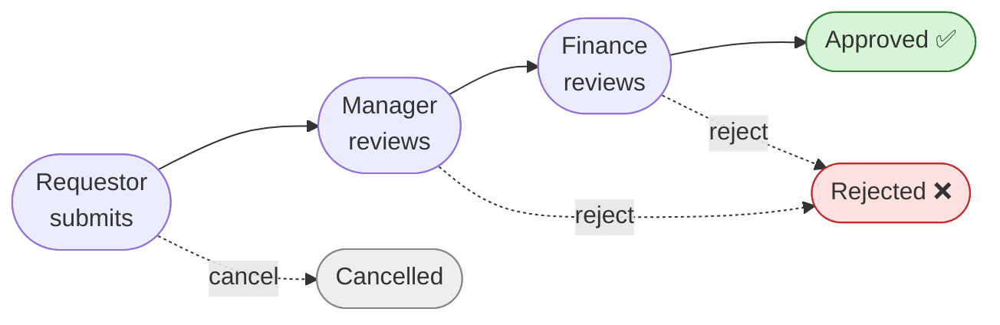
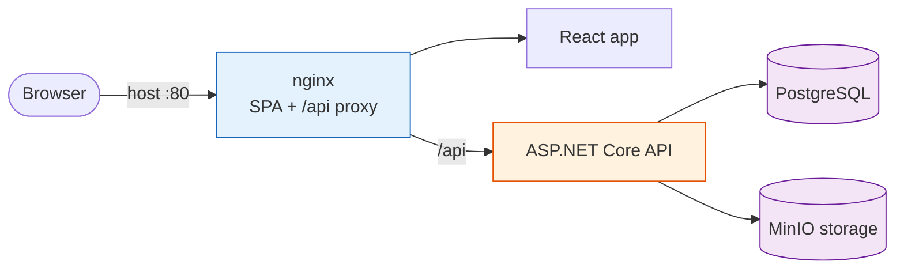

# Sponsorship Request Approval Workflow

A workflow-driven enterprise module for submitting and approving internal sponsorship requests,
built for a Senior Full-Stack .NET technical assessment.

> **Status:** In active development. Local debug setup is documented below; production deploy
> runbook in [`docs/deploy.md`](docs/deploy.md).

## What it does
Staff submit sponsorship requests that move through an approval workflow — **Draft → Pending
Manager Approval → Pending Finance Review → Approved**, with **Rejected** and **Cancelled** paths —
with role-based access (Requestor, Manager, Finance Admin, System Admin) and an immutable audit
history.



## Architecture at a glance



Clean Architecture backend (Domain ← Application ← Api; Infrastructure implements Application ports),
a React SPA, and nginx as the single front door. **Full explanation with all flow diagrams (auth,
request lifecycle, layering, deployment): [`docs/architecture.md`](docs/architecture.md).**

## Tech stack
- **Backend:** .NET 10, ASP.NET Core (Clean Architecture + CQRS, MediatR, AutoMapper, EF Core 10)
- **Database:** PostgreSQL 17 · **Storage:** MinIO (S3-compatible)
- **Frontend:** React 19 + TypeScript (Vite)
- **Infra:** Docker Compose + nginx · CI via GitHub Actions

## Repository layout
```
backend/    .NET solution (Domain / Application / Infrastructure / Api + tests)
frontend/   React + TypeScript app (added in T0.2)
docs/        specs, design, workflow, best-practice rulebooks, task backlog
.github/     PR template + CI workflows
```

## Documentation
- [Architecture (as-built, with diagrams)](docs/architecture.md) — start here for how the system works
- [Requirements brief](docs/requirements/NET%20Senior%20Developer%20Tech%20Assessment.md)
- [Business requirements — clarifications & assumptions](docs/requirements-clarifications.md)
- [High-level design & rationale](docs/high-level-design.md)
- [Deployment runbook](docs/deploy.md) — Docker Compose bring-up + verification
- [Development workflow](docs/workflow.md)
- [Task backlog](docs/tasks/README.md) · [Deferred items](docs/backlog.md)
- [Best-practice rulebooks](docs/best-practices/)

## Getting started

Two ways to run locally:

| Mode | Best for | App URL |
|------|----------|---------|
| **Local debug** (recommended) | Day-to-day development, breakpoints, hot reload | http://localhost:5173 |
| **Docker Compose** | Full-stack smoke test, production-like nginx build | http://localhost |

See also [`backend/README.md`](backend/README.md), [`frontend/README.md`](frontend/README.md), and
[`docs/deploy.md`](docs/deploy.md) for deployment details.

---

## Local development (debug workflow)

Run **PostgreSQL + MinIO in Docker**, then start the **API** and **frontend dev server** on your
machine. This gives you:

- Frontend hot reload (Vite) at port **5173**
- API breakpoints and `dotnet watch` at port **5256**
- Vite proxy forwarding everything under `/api` to the API and stripping the prefix — mirroring nginx
  in production (see `frontend/vite.config.ts`)

### Prerequisites

| Tool | Version | Notes |
|------|---------|--------|
| Docker | Compose plugin | For Postgres + MinIO only |
| .NET SDK | 10.0.x | `dotnet --version` |
| Node.js | 24.x | `frontend/package.json` `engines.node` |

### 1. Start infrastructure (Postgres + MinIO)

From the repo root, start named containers with host ports so the native API can reach them:

```bash
docker run -d --name sqaf-db \
  -e POSTGRES_DB=sponsorship_approval \
  -e POSTGRES_USER=sponsorship_app \
  -e POSTGRES_PASSWORD=change-me-local-postgres-password \
  -p 5432:5432 \
  postgres:17.9-alpine3.23

docker run -d --name sqaf-minio \
  -e MINIO_ROOT_USER=minioadmin \
  -e MINIO_ROOT_PASSWORD=change-me-local-minio-password \
  -p 9000:9000 -p 9001:9001 \
  minio/minio:RELEASE.2025-09-07T16-13-09Z-cpuv1 \
  server /data --console-address ":9001"
```

**Stop / start / remove**

```bash
# Stop (keeps containers; data persists in container filesystem)
docker stop sqaf-db sqaf-minio

# Start again later
docker start sqaf-db sqaf-minio

# Remove containers (only if you want a clean slate)
docker rm -f sqaf-db sqaf-minio
```

Check what is running: `docker ps`

### 2. Start the API (with debugger support)

In a terminal, export config for **localhost** (not Docker service names), then run the API:

```bash
cd backend

export ConnectionStrings__Default="Host=localhost;Port=5432;Database=sponsorship_approval;Username=sponsorship_app;Password=change-me-local-postgres-password"
export Minio__Endpoint="http://localhost:9000"
export Minio__AccessKey="minioadmin"
export Minio__SecretKey="change-me-local-minio-password"
export Minio__BucketName="sponsorship-attachments"
export Jwt__Issuer="sponsorship-approval-local"
export Jwt__Audience="sponsorship-approval-api"
export Jwt__SigningKey="change-me-local-jwt-signing-key-at-least-32-characters"

dotnet run --project src/Api --launch-profile http
```

On first start the API applies EF migrations and seeds demo data automatically.

**Debug tips**

- Attach your IDE debugger to the running `dotnet` process, or use **Run and Debug** with the
  `http` profile in `backend/src/Api/Properties/launchSettings.json`.
- For auto-restart on code changes: `dotnet watch run --project src/Api --launch-profile http`
  (same env vars must still be set).
- Sanity check: `curl http://localhost:5256/health/ready` (JSON with `postgres` + `minio` status)
- Liveness: `curl http://localhost:5256/health/live`
- API docs (Scalar UI): http://localhost:5256/scalar/v1
- OpenAPI document: http://localhost:5256/openapi/v1.json

**Stop:** `Ctrl+C` in the API terminal.

### 3. Start the frontend dev server

In another terminal:

```bash
cd frontend
npm install          # first time only
npm run dev
```

Open http://localhost:5173 — the Vite dev server proxies API calls to http://localhost:5256.

**Debug tips**

- Use browser DevTools (Network tab for API calls, React DevTools for UI state).
- Edit files under `frontend/src/` — Vite hot-reloads without restarting.

**Stop:** `Ctrl+C` in the frontend terminal.

### Typical daily flow

```text
1. docker start sqaf-db sqaf-minio     # if stopped from yesterday
2. cd backend && (export env vars…) && dotnet run --project src/Api --launch-profile http
3. cd frontend && npm run dev
4. Log in at http://localhost:5173
5. Ctrl+C frontend, Ctrl+C API when done
6. docker stop sqaf-db sqaf-minio      # optional — leave running if you prefer
```

---

## Full stack with Docker Compose (smoke test)

Use this when you want the built SPA behind nginx (no hot reload). Requires port **80** free.

```bash
cp .env.example .env    # optional local overrides
docker compose up --build
```

Open http://localhost

**Stop**

```bash
docker compose down              # keep volumes
docker compose down --volumes    # wipe DB + MinIO data
```

**Stop individual compose services**

```bash
docker compose stop db minio api nginx
docker compose start db minio    # start only what you need
```

Smoke checks: `curl --fail http://localhost/api/health/ready` (readiness) or `curl --fail http://localhost/api/health/live` (liveness). `/health` and `/health/ready` verify dependencies; `/health/live` checks the API process only.

> **Note:** Compose uses internal Docker network hostnames (`db`, `minio`). The debug workflow
> above uses `localhost` ports instead so you can run the API and frontend natively.

---

## Configuration (environment variables)

The app is configured entirely through environment variables (see [`.env.example`](.env.example)).
The **canonical, fully-documented reference is [`docs/deploy.md` §3](docs/deploy.md#3-environment--configuration)** —
the summary below is just the essentials.

| Group | Variables | Notes |
|-------|-----------|-------|
| Compose | `COMPOSE_ENV_FILE`, `ASPNETCORE_ENVIRONMENT` | Which env file to load; runtime environment |
| Database | `POSTGRES_DB`, `POSTGRES_USER`, `POSTGRES_PASSWORD` 🔒 | Postgres credentials |
| Storage | `MINIO_ROOT_USER`, `MINIO_ROOT_PASSWORD` 🔒 | MinIO credentials |
| API → DB | `ConnectionStrings__Default` 🔒 | Embeds the DB password |
| API → MinIO | `Minio__Endpoint`, `Minio__AccessKey`, `Minio__SecretKey` 🔒, `Minio__BucketName` | Object storage |
| API → JWT | `Jwt__Issuer`, `Jwt__Audience`, `Jwt__SigningKey` 🔒 (≥ 32 chars), `Jwt__AccessTokenLifetimeMinutes`, `Jwt__RefreshTokenLifetimeDays` | Token issuance |

🔒 = **secret**. `.env.example` ships `change-me-*` placeholders only — **never commit a real `.env`**.
The `__` in app vars maps to nested .NET config (`Jwt__SigningKey` → `Jwt:SigningKey`).

---

## Live URLs

> **Pending deployment (T4.3).** Once the stack is hosted, the live endpoints go here:

| Surface | URL |
|---------|-----|
| Web app | _to be added_ |
| API | _to be added_ `/api` |
| API docs (Scalar) | _to be added_ `/scalar/v1` |
| Repository | https://github.com/dashu-baba/sponsor-request-approval-flow |
| Deployment notes | [`docs/deploy.md`](docs/deploy.md) |

Locally the equivalents are http://localhost/ (app), http://localhost/api, http://localhost/scalar/v1.

---

## Test accounts (development / demo only)

After the API starts (locally or via Docker Compose), the database is seeded with one account per
role. These credentials are **for local testing only** — never use them in production.

| Role | Email | Password |
|------|-------|----------|
| Requestor | `requestor@demo.local` | `Password1!` |
| Manager | `manager@demo.local` | `Password1!` |
| Finance Admin | `finance@demo.local` | `Password1!` |
| System Admin | `admin@demo.local` | `Password1!` |

The seed data also includes sponsorship types and sample requests in every workflow status so
reviewers can exercise approvals immediately.
