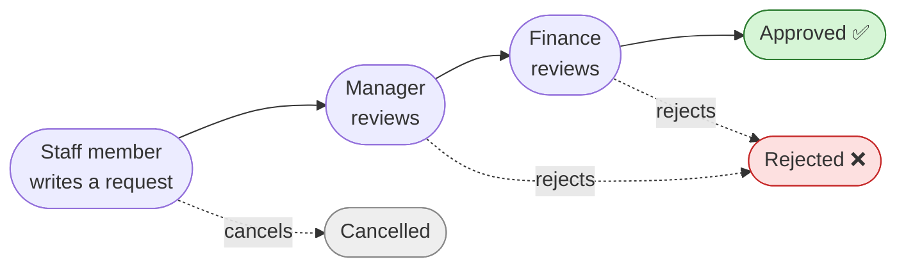
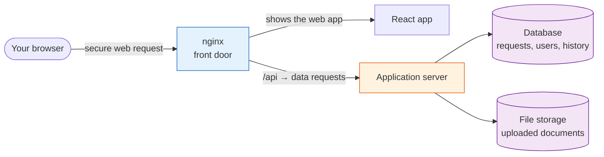
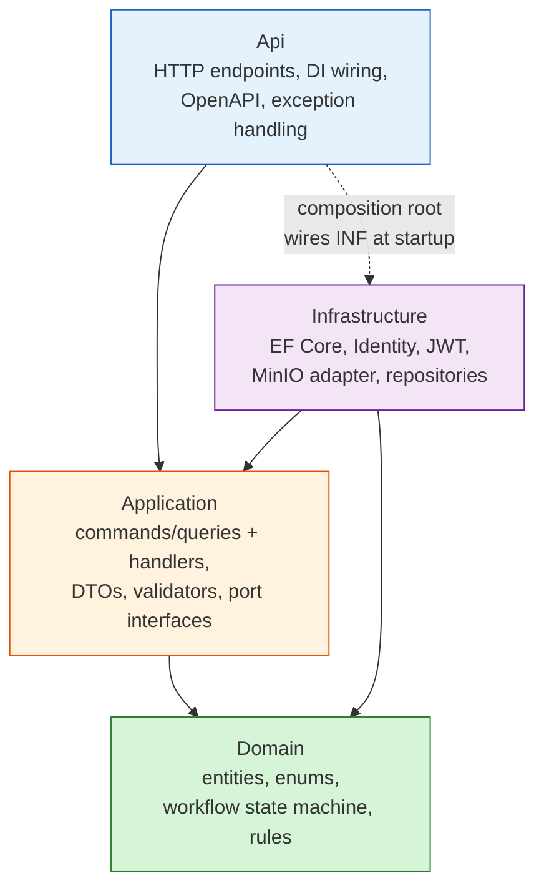
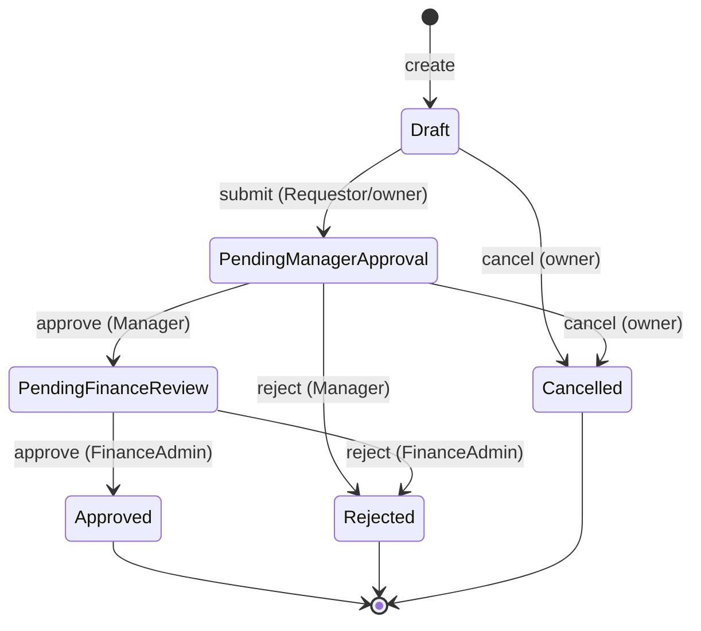
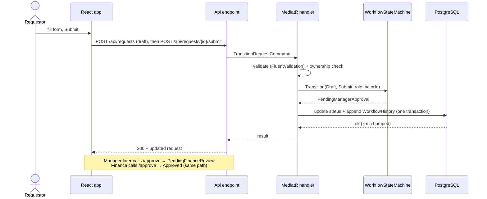
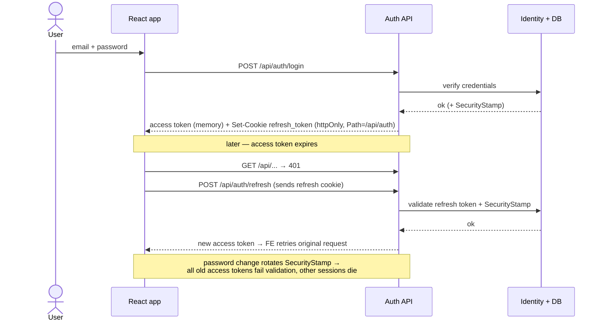
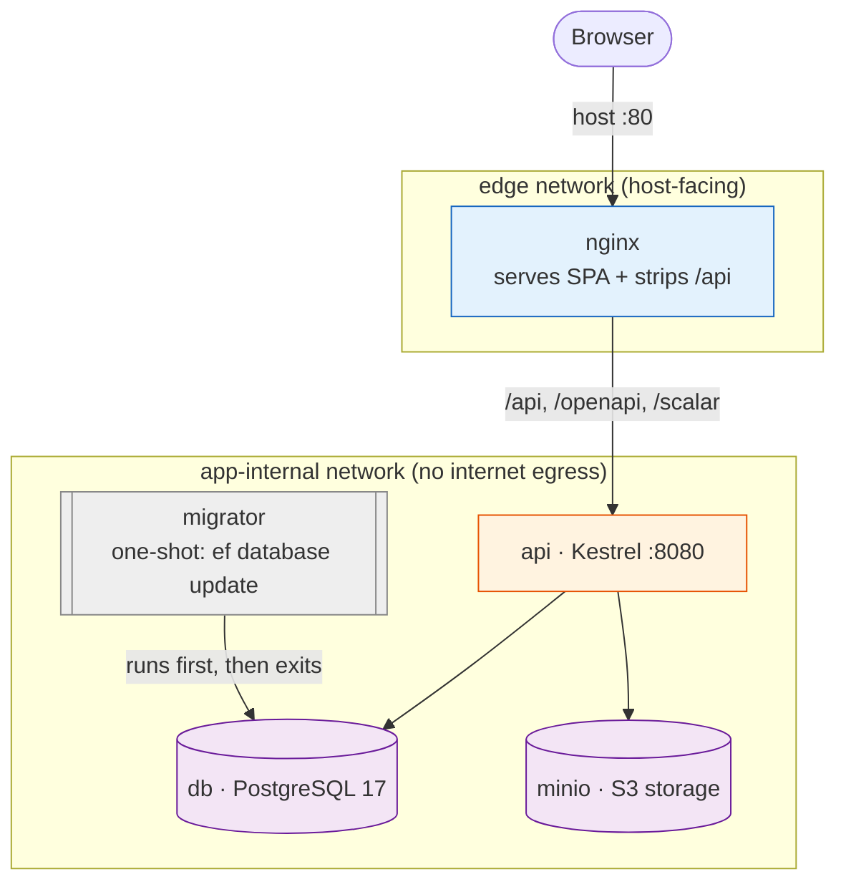

# Architecture — Sponsorship Request Approval Workflow

This document explains **how the system is built and why**, for two audiences:

- **Part 1 — In plain language** is for anyone (product, business, a new teammate). No code knowledge needed.
- **Part 2 — Technical detail** is for engineers: layering, data, security, and the request paths.

Every major flow has a diagram. Diagrams are written in [Mermaid](https://mermaid.js.org/) and render
automatically on GitHub.

> Related docs: [High-Level Design](./high-level-design.md) (design rationale & decisions),
> [Business rules](./requirements-clarifications.md) (A1–D1), [Deployment runbook](./deploy.md).

---

# Part 1 — In plain language

## What this system does

Staff need money approved to sponsor events. Today that happens over email and spreadsheets, which
is slow and hard to audit. This system replaces that with a simple, trackable online workflow.

A request moves through four stages, like a document passing across four desks:

1. **A staff member (Requestor)** fills in a request — what the event is, how much money, why — and submits it.
2. **A Manager** looks at it and either approves (passes it on) or rejects it.
3. **Finance** does the final check and either approves (done) or rejects it.
4. The request ends as **Approved**, **Rejected**, or — if the author pulled it back early — **Cancelled**.

Every step is recorded with who did it and when, so there is always a clear, tamper-proof history.

## Who uses it (the four roles)

| Role | What they can do |
|------|------------------|
| **Requestor** | Create, edit (while draft), submit, and cancel **their own** requests; upload supporting files |
| **Manager** | Review the requests waiting at the manager stage — approve or reject |
| **Finance Admin** | Review the requests waiting at the finance stage — approve or reject |
| **System Admin** | See all submitted requests + full history, manage sponsorship types, and create/list user accounts. **Does not** approve requests |

Two guardrails worth knowing in plain terms:
- **You can't approve your own request** — even if a manager files a request, someone else must review it.
- **Drafts are private** — a half-written request is visible only to its author until it's submitted.

## The big picture

When you open the website, here's what happens behind the scenes:

- **nginx** is the single front door. It serves the web app and forwards data requests to the application server.
- The **application server** holds all the rules (who can do what, which stage is next).
- The **database** stores requests, users, and the history trail.
- **File storage** keeps uploaded documents (PDFs, images) separate from the database.

That's the whole system in one breath. The rest of this document is the engineering detail.

---

# Part 2 — Technical detail

## 2.1 Technology at a glance

| Concern | Choice |
|---------|--------|
| Backend runtime | .NET 10, ASP.NET Core (minimal APIs) |
| Architecture | Clean Architecture + CQRS-lite (MediatR), AutoMapper, FluentValidation |
| Data | EF Core 10 + Npgsql, **PostgreSQL 17** (snake_case, `numeric(18,2)` money, `timestamptz`, `xmin` concurrency) |
| Identity | ASP.NET Core Identity + JWT access token + httpOnly refresh cookie |
| File storage | MinIO (S3-compatible) |
| API docs | Microsoft.AspNetCore.OpenApi + Scalar UI (`/scalar/v1`, `/openapi/v1.json`) |
| Frontend | React 19 + TypeScript (Vite, Node 24), TanStack Query, React Router, React-Hook-Form + Zod |
| Delivery | Docker Compose + nginx |

## 2.2 Backend layering (Clean Architecture)

Dependencies point **inward**. The Domain knows nothing about the outside world; Infrastructure
implements interfaces that Application defines.

- **Domain** (`backend/src/Domain`) — `SponsorshipRequest`, statuses, and the `WorkflowStateMachine`. Pure C#, no dependencies.
- **Application** (`backend/src/Application`) — one `Command`/`Query` + handler per use case, dispatched via **MediatR**; FluentValidation and logging run as pipeline behaviors. Defines `port` interfaces (e.g. storage, current-user) that Infrastructure implements.
- **Infrastructure** (`backend/src/Infrastructure`) — EF Core `AppDbContext` + migrations, ASP.NET Identity, JWT issuance, the MinIO storage adapter, and the audit-history write path.
- **Api** (`backend/src/Api`) — thin minimal-API endpoints grouped by area (`AuthEndpoints`, `RequestEndpoints`, `SponsorshipTypeEndpoints`, `UserEndpoints`, `SystemEndpoints`); composition root; OpenAPI; global ProblemDetails exception handling.

**Dependency rule:** `Api → Application → Domain`, and `Infrastructure → Application/Domain`. The Domain depends on nothing.

## 2.3 The request lifecycle (state machine)

The heart of the system. The Domain rejects any transition not in this diagram.

Rules enforced by the machine and handlers:

- **Edit only while `Draft`** (A1); after submit, only workflow actions + remarks change.
- **Cancel only in `Draft` / `PendingManagerApproval`** (A2) — not after a manager approves.
- **`Rejected` is terminal** (A3); finance rejection goes straight to `Rejected` (A4).
- **Remarks required on Reject**, optional on Approve (A5).
- **No self-approval** (B4): a reviewer cannot action a request they created.
- **Single linear flow** (A6): every request goes Manager → Finance, regardless of amount.

Error mapping: an **invalid state** transition → `InvalidOperationException` → **HTTP 409**; a
**wrong-role** attempt → `UnauthorizedAccessException` → **HTTP 403**. Concurrent transitions on the
same request are guarded by the Postgres `xmin` optimistic-concurrency token — the losing writer
gets **409** instead of a double-transition. Every successful transition appends a `WorkflowHistory`
row (immutable audit, D1).

## 2.4 End-to-end: create → submit → approve

How a request travels through the layers, including the audit write and role checks:

## 2.5 Authentication & sessions

Stateless JWT access tokens (short-lived, kept **in memory** in the SPA) plus a long-lived
**httpOnly refresh cookie** scoped to `Path=/api/auth`. Password changes invalidate every previously
issued access token via the Identity **SecurityStamp** claim.

Key points:
- **Access token in memory, never `localStorage`** — limits XSS token theft.
- **Refresh cookie is httpOnly + SameSite=Strict + `Path=/api/auth`** — the browser only sends it to the refresh/logout endpoints.
- On **every request**, JWT bearer validation compares the token's `security_stamp` claim to the user's current stamp; a mismatch (e.g. after a password change) → 401.

## 2.6 Authorization (RBAC)

Two enforcement layers, both server-side:

1. **Endpoint policies** — role claims gate each route (e.g. `/users` requires `SystemAdmin`; approve/reject gated by stage role).
2. **Resource/ownership checks in handlers** — a Requestor only acts on their own requests; queues are scoped by role.

| Capability | Requestor | Manager | Finance Admin | System Admin |
|------------|:--------:|:-------:|:-------------:|:------------:|
| Create / edit own draft | ✅ | — | — | — |
| Submit / cancel own request | ✅ | — | — | — |
| See own requests | ✅ | — | — | — |
| Approve / reject at manager stage | — | ✅ | — | — |
| Approve / reject at finance stage | — | — | ✅ | — |
| See all **submitted** requests + history | — | — | — | ✅ |
| Manage sponsorship types | — | — | — | ✅ |
| Create / list users | — | — | — | ✅ |
| View **drafts** of others | — | — | — | — (drafts are private, B5) |

System Admin is **not** in the approval chain (B3). Each user holds **exactly one role**, and accounts
are provisioned (no self-registration) (B6).

## 2.7 Data model

| Entity | Notes |
|--------|-------|
| `SponsorshipRequest` | Core entity; `decimal` amount → `numeric(18,2)`; `Status`; `RequestorId`; `xmin` concurrency token |
| `SponsorshipType` | Lookup managed by System Admin |
| `WorkflowHistory` | Immutable audit row per transition: actor, from, to, remarks, timestamp (D1) |
| `Attachment` | `ObjectKey` (MinIO), filename, content type, size — bytes live in MinIO, metadata in Postgres |
| `User` / `Role` | ASP.NET Identity; roles: Requestor, Manager, FinanceAdmin, SystemAdmin |

Conventions: **snake_case** identifiers (`EFCore.NamingConventions`), all timestamps `timestamptz`
(UTC), money as `numeric` (never Postgres `money`).

## 2.8 API & frontend routing (the `/api` prefix)

The browser calls everything under **`/api`** (e.g. `/api/requests`). Both the Vite dev proxy and the
production nginx **strip `/api`** before forwarding, so the backend still exposes plain routes
(`/requests`, `/auth`, …). SPA page URLs like `/requests/7` are **not** prefixed and are served by the
React router — which is why a browser refresh on a detail page returns the app, not a 401.

| Surface | Browser path | Reaches backend as |
|---------|-------------|--------------------|
| API call | `/api/requests/7` | `/requests/7` |
| Auth | `/api/auth/login` | `/auth/login` |
| SPA page | `/requests/7` | served `index.html` (no proxy) |
| API docs | `/scalar/v1`, `/openapi/v1.json` | proxied unchanged |

Frontend structure (`frontend/src`): `app/` (router, providers, layout) · `features/` (`auth`,
`requests`, `approvals`, `admin`, `account`) · `lib/` (typed API client, query hooks, Zod schemas) ·
`components/` (shadcn/ui shared components). Zod schemas mirror backend FluentValidation rules.

## 2.9 Deployment topology

See [`deploy.md`](./deploy.md) for the step-by-step runbook. The shape:

- **nginx** is the only host-facing service (on the `edge` network); it publishes port 80, serves the built SPA, and reverse-proxies `/api`, `/openapi`, `/scalar` to the API.
- **db**, **minio**, **api**, **migrator** sit on `app-internal`, which is `internal: true` — **no outbound internet**, not reachable from the host.
- **migrator** is a one-shot service: it runs `dotnet ef database update`, completes, and the API only starts after it succeeds (`depends_on: service_completed_successfully`).

> **As-built note:** the API *also* runs migrate-and-seed on startup (`MigrateAndSeedAsync`), so on a
> fresh database the migrator applies schema and the API performs seeding. Migrations are idempotent,
> so the two paths don't conflict — but the redundancy is a candidate for simplification (track in backlog).

## 2.10 Testing strategy

| Layer | What | Tooling |
|-------|------|---------|
| Unit (Domain) | State-machine transitions (valid + invalid pairs, self-approval), RBAC visibility | xUnit + FluentAssertions |
| Unit (Application) | Validators (amount/date/required fields), handler behavior | xUnit + fakes |
| Integration (Api) | Real Postgres via **Testcontainers** + `WebApplicationFactory`: auth flows, workflow, RBAC 401/403, OpenAPI doc | xUnit |
| Frontend | Component/state tests (loading, empty, error, forms) | Vitest + Testing Library |
| Deployment | `docker compose up` smoke (see [deploy.md](./deploy.md)) — health, login, list, refresh, deep-link, docs | curl checklist |

CI (GitHub Actions) runs backend (build warnings-as-errors, `dotnet format`, tests) and frontend
(typecheck, ESLint, Prettier, build, tests) on every PR.

---

*This document describes the system as built. For the original design rationale and decision log, see
[high-level-design.md](./high-level-design.md).*
