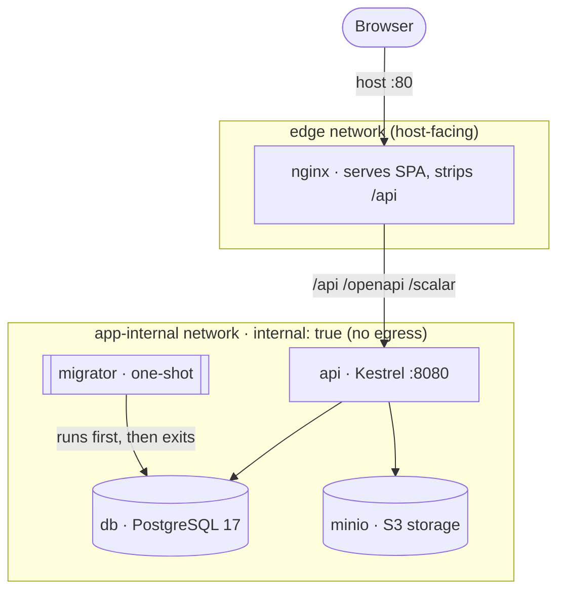

# Deployment Runbook

How to run the full stack with Docker Compose, what each service is, the environment it needs, and
how to verify a deployment is healthy (automated + manual). This path has been brought up and smoke-
tested end-to-end.

> For local **development** (native API + Vite hot reload), see the root [`README.md`](../README.md).
> For the architecture behind this topology, see [`architecture.md`](./architecture.md) §2.9.

---

## 1. Prerequisites

- Docker Engine with the Compose plugin (`docker compose version`).
- Host **port 80** free.
- No local PostgreSQL or MinIO needed — Compose provides them.

## 2. Topology



| Service | Role | Network(s) | Host port |
|---------|------|-----------|-----------|
| `nginx` | Serves built SPA; reverse-proxies `/api`, `/openapi`, `/scalar` to the API; strips the `/api` prefix | `edge` + `app-internal` | **80** → 8080 |
| `api` | ASP.NET Core (Kestrel) on `:8080`; migrates + seeds on first start | `app-internal` | — |
| `migrator` | One-shot `dotnet ef database update`; the API waits for it to complete | `app-internal` | — |
| `db` | PostgreSQL 17, named volume `db-data` | `app-internal` | — |
| `minio` | S3-compatible object storage, named volume `minio-data` | `app-internal` | — |

**Why two networks:** `app-internal` is `internal: true` — db/minio/api/migrator have **no outbound
internet** and aren't reachable from the host. Only `nginx` joins the host-facing `edge` network, so
port 80 is the single public surface. (Attaching a service *only* to an internal network prevents
host port publishing — nginx must be on `edge` to expose port 80.)

**Startup order** (enforced by `depends_on` + healthchecks):
`db healthy` → `migrator` runs and exits 0 → `api` healthy → `nginx` healthy.

## 3. Environment / configuration

Compose reads variables from the file named by `COMPOSE_ENV_FILE` (defaults to `.env.example`).

```bash
# Default (uses .env.example — fine for a local trial):
docker compose up --build

# With your own values:
cp .env.example .env
# edit .env — replace every change-me-* value
COMPOSE_ENV_FILE=.env docker compose up --build
```

Keep real `.env` files out of git. **This table is the canonical environment reference.**

| Variable | Scope | Purpose | Example / default | Secret? |
|----------|-------|---------|-------------------|:------:|
| `COMPOSE_ENV_FILE` | compose | Which env file Compose mounts | `.env.example` | no |
| `ASPNETCORE_ENVIRONMENT` | api | Runtime environment | `Production` | no |
| `POSTGRES_DB` | db | Database name | `sponsorship_approval` | no |
| `POSTGRES_USER` | db | DB role | `sponsorship_app` | no |
| `POSTGRES_PASSWORD` | db | DB password | `change-me-*` | **yes** |
| `MINIO_ROOT_USER` | minio | MinIO admin user | `minioadmin` | no |
| `MINIO_ROOT_PASSWORD` | minio | MinIO admin password | `change-me-*` | **yes** |
| `ConnectionStrings__Default` | api | Postgres connection string | `Host=db;Port=5432;Database=...;Username=...;Password=...` | **yes** (embeds pw) |
| `Minio__Endpoint` | api | MinIO URL | `http://minio:9000` | no |
| `Minio__AccessKey` | api | MinIO access key | `minioadmin` | no |
| `Minio__SecretKey` | api | MinIO secret | `change-me-*` | **yes** |
| `Minio__BucketName` | api | Attachment bucket | `sponsorship-attachments` | no |
| `Jwt__Issuer` | api | JWT issuer | `sponsorship-approval` | no |
| `Jwt__Audience` | api | JWT audience | `sponsorship-approval-api` | no |
| `Jwt__SigningKey` | api | HMAC signing key — **≥ 32 chars** | `change-me-*-at-least-32-characters` | **yes** |
| `Jwt__AccessTokenLifetimeMinutes` | api | Access-token TTL | `15` | no |
| `Jwt__RefreshTokenLifetimeDays` | api | Refresh-token TTL | `7` | no |

> The `__` (double underscore) in app variables maps to nested .NET config (e.g. `Jwt__SigningKey` →
> `Jwt:SigningKey`). The README carries a short summary; this table is the source of truth.

## 4. Bring the stack up

```bash
docker compose up --build -d      # build images and start detached
docker compose ps                 # all services should reach healthy / migrator Exited (0)
```

Expected steady state:

```
db        healthy
minio     healthy
migrator  exited (0)
api       healthy
nginx     healthy
```

## 5. Verify the deployment

### 5a. Automated (CI)

Every PR runs GitHub Actions (`.github/workflows/ci.yml`): **Backend** (build warnings-as-errors,
`dotnet format --verify-no-changes`, unit + Testcontainers integration tests) and **Frontend**
(typecheck, ESLint, Prettier, build, Vitest). A green CI is the gate before deploy.

### 5b. Manual smoke (run after `up`)

The whole flow goes through nginx and the `/api` prefix — exactly what the browser uses.

```bash
# 1. SPA + API health
curl -f  http://localhost/                       # 200, text/html (SPA shell)
curl -f  http://localhost/api/health/live        # 200 — API process is up (no dependency checks)
curl -f  http://localhost/api/health/ready        # 200 — readiness: PostgreSQL + MinIO reachable

# 2. Auth + data (cookie jar captures the refresh cookie)
JAR=$(mktemp)
curl -s -c "$JAR" -X POST http://localhost/api/auth/login \
  -H 'Content-Type: application/json' \
  -d '{"email":"admin@demo.local","password":"Password1!"}' -o /tmp/login.json
TOKEN=$(python3 -c "import json;print(json.load(open('/tmp/login.json'))['accessToken'])")

curl -f http://localhost/api/requests -H "Authorization: Bearer $TOKEN" >/dev/null   # 200
curl -f http://localhost/api/users    -H "Authorization: Bearer $TOKEN" >/dev/null   # 200 (admin only)
curl -f -b "$JAR" -X POST http://localhost/api/auth/refresh >/dev/null               # 200 (cookie round-trip)

# 3. SPA deep link must return HTML, not a 401
curl -s -o /dev/null -w '%{http_code} %{content_type}\n' http://localhost/requests/1  # 200 text/html

# 4. API docs
curl -f http://localhost/scalar/v1        >/dev/null   # 200 (Scalar UI)
curl -f http://localhost/openapi/v1.json  >/dev/null   # 200 (OpenAPI doc)

# 5. Auth gate
curl -s -o /dev/null -w '%{http_code}\n' http://localhost/api/requests  # 401 without a token

rm -f "$JAR" /tmp/login.json
```

**Health endpoints:** `/health/live` checks only that the API process is running (use for liveness);
`/health/ready` (and `/health`) verify dependencies — PostgreSQL and MinIO — so use it for readiness
gating. The stack is fully up once `db`, `minio`, `migrator`, `api`, and `nginx` are healthy.

Also confirm the refresh cookie is scoped correctly: `Set-Cookie` on login should carry
`Path=/api/auth; HttpOnly; SameSite=Strict`.

**Verified:** on a clean volume the stack reaches all-healthy and the checklist above passes 10/10
(SPA, health, login, requests, users, refresh, deep-link, Scalar, OpenAPI, unauth→401).

## 6. Browse it

| Surface | URL |
|---------|-----|
| Web app | http://localhost/ |
| API (through proxy) | http://localhost/api/... |
| API docs (Scalar) | http://localhost/scalar/v1 |
| OpenAPI JSON | http://localhost/openapi/v1.json |

Log in with any seeded account (see [README → Test accounts](../README.md#test-accounts-development--demo-only)).

## 7. Shutdown / reset

```bash
docker compose down              # stop, keep data volumes
docker compose down --volumes    # stop and wipe DB + MinIO (clean reset)
```

## 8. Troubleshooting

| Symptom | Cause | Fix |
|---------|-------|-----|
| `migrator` exits 1 with `relation ... already exists` | Dirty `db-data` volume from an earlier/partial run | `docker compose down --volumes` then `up` again |
| Host `curl http://localhost/` refused | nginx not on the `edge` network / port not published | Ensure `nginx` lists both `edge` and `app-internal` networks |
| `nginx` stuck `unhealthy` but site loads | Healthcheck used `localhost` (resolves to IPv6) | Healthcheck targets `127.0.0.1:8080` |
| `minio` `unhealthy` | Image has no `curl`/`wget` | Healthcheck uses `bash` + `/dev/tcp` liveness probe |

## 9. Production hardening (out of scope here → T4.3)

TLS termination (Let's Encrypt), backups, secret management, log shipping, and resource limits are
deployment-finalize concerns tracked under T4.3. This runbook covers a correct, verified single-host
Compose bring-up.
